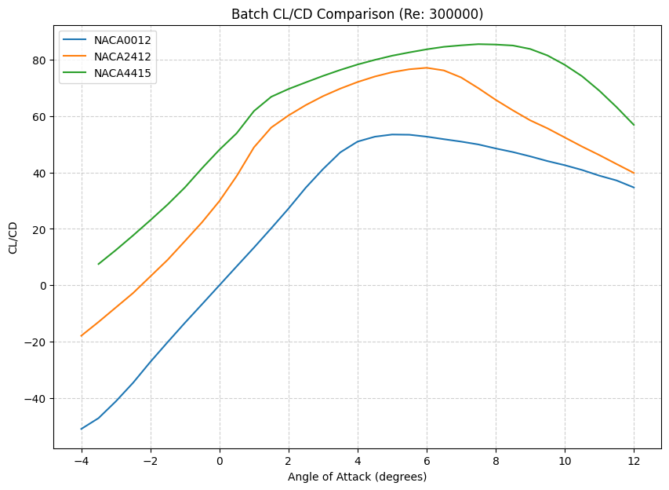

# Airfoil optimizer

An optimization program that utilizes XFOIL for single NACA 4-digit or custom-airfoil analysis and parallel batch comparison of a supplied NACA list. Batch optimization selects the best observed lift, lift-to-drag ratio, and drag among those candidates; it does not generate new airfoil shapes.

## Example outputs



Real XFOIL outputs at Reynolds number 300,000: NACA 0012, 2412, and 4415, swept from -4 to 12 degrees in 0.5-degree steps. Some sweeps are partial; the report identifies missing angles. Lines connect available samples and do not prove convergence between them.

Browse the [five-case example gallery](examples/README.md) for geometry and polar plots, analysis reports, raw data, custom input, and failure diagnostics. The [batch report](examples/batch_comparison/Batch_Optimization_Report.txt) shows rankings and coverage together.

## Install on Windows

The tested configuration is **Windows, Python 3.13, and XFOIL 6.99**. Other Python versions and platforms have not been verified for this release.

1. Install Python 3.13.
2. Obtain XFOIL separately from the [official downloads page](https://web.mit.edu/drela/Public/web/xfoil/). Use the Windows XFOIL 6.99 package, retain its accompanying license notices, and place `xfoil.exe` beside `main.py` or on your `PATH`. XFOIL is not included in this source release. See [third-party notices](THIRD_PARTY_NOTICES.md).
3. From this directory, create an environment and install the Python dependencies:

```powershell
py -3.13 -m venv .venv
.\.venv\Scripts\python.exe -m pip install -r requirements.txt
.\.venv\Scripts\python.exe main.py
```

If `py` is unavailable, substitute the full path to your Python 3.13 executable. Environment activation is not required. Create a new environment after cloning; virtual environments are not portable.

The configuration and `output` folder are anchored to the application directory. Relative custom input paths are relative to your shell's working directory; absolute paths, quoted paths, and filenames with spaces are supported. `xfoil_config.example.json` shows the defaults; the application works without a configuration file and writes your personal `xfoil_config.json` when you save settings.

## Feature guide

### 1. Analyze a NACA airfoil

Choose the first menu option and enter a four-digit NACA code (keep leading zeros, for example `0012`), Reynolds number, starting angle, ending angle, and increment. The program generates the geometry in XFOIL, panels it, runs a viscous angle-of-attack sweep, and analyzes the converged polar rows. Every run gets a unique results folder, so repeated analyses preserve earlier results.

For the published NACA 2412 example, set 300 iterations, 240 panel nodes, and a 30-second timeout in Settings, then enter `2412`, `300000`, `-4`, `12`, and `0.5`. See its [report](examples/naca2412/Analysis_Report.txt) and [lift plot](examples/naca2412/CL_vs_Alpha.png).

### 2. Analyze a custom airfoil

Supply a plain or labeled two-column `.dat`/`.txt` file containing finite `x y` coordinates in perimeter order: from one trailing-edge side around the leading edge to the other trailing-edge side. Numeric titles such as `2412` are supported. At least three distinct points and a nonzero chord are required. Multi-block formats such as Lednicer must first be converted to this format. Quoted paths and filenames containing spaces are accepted.

The program validates the coordinates, stages the input in a private solver directory, normalizes it, and performs the same sweep, metrics, and plotting as NACA analysis. The [custom example](examples/README.md#2-custom-coordinate-normalization) includes both the scaled/translated input and the normalized coordinates used for analysis.

### 3. Configure the solver

Settings apply to subsequent runs. Choose a setting in the Settings menu, enter its value, then choose **Save and Back** to persist the configuration.

| Setting | Default | What it controls |
| --- | --- | --- |
| Maximum iterations | 100 | XFOIL's iteration limit for convergence at each operating point; accepts positive integers through 2,147,483,647. Increasing it does not guarantee convergence. |
| Panel nodes | 160 | Requested surface discretization; accepts even integers from 10 to 494. More panels change numerical resolution and computation cost. |
| Timeout | 120 seconds | Maximum solver runtime per airfoil; accepts positive values up to 86,400 seconds. Each batch job has its own timeout. |

All batch workers receive the same settings snapshot. Configuration is stored beside the application in `xfoil_config.json`; an example file documents defaults. Invalid saved settings restore defaults. Atomic saves preserve the previous configuration if writing fails, and UTF-8 files with a byte-order mark are accepted.

### 4. Compare a batch of NACA airfoils

Enter comma-separated four-digit codes, such as `0012,2412,4415`, followed by common Reynolds and sweep inputs. Invalid entries are identified for correction. Jobs execute in parallel in isolated working directories; duplicate codes remain separate numbered jobs. One job's failure is recorded without discarding the other candidates' results.

The batch report lists candidates by name, reports convergence coverage and failures, and selects the largest observed lift, largest observed lift-to-drag ratio, and smallest observed drag. Two overlay plots compare lift and efficiency versus angle. Partial sweeps can participate in rankings, so a winner is the best available sample among the supplied candidates, not a guaranteed global optimum.

### 5. Read the aerodynamic metrics

| Metric | Meaning and supporting output |
| --- | --- |
| Maximum observed lift, `CL_max` | Largest valid sampled lift coefficient, with its angle of attack. Does not establish stall; the report marks stall angle undetermined. |
| Maximum efficiency, `CL/CD_max` | Largest sampled lift-to-drag ratio, with the corresponding angle, lift, and drag coefficients. |
| Minimum drag, `CD_min` | Smallest valid sampled drag coefficient, with its angle and lift coefficient. |
| Lift slope | Least-squares slope of available lift samples between -5 and 5 degrees, reported per degree and per radian. Unresolved data produces an unavailable result. |
| Coverage | Number of converged requested points, total requested points, missing angles, and discarded polar rows. |

Zero and negative lift are valid. Invalid rows are excluded individually instead of losing an otherwise usable polar. The parser accepts scientific notation including Fortran `D` exponents and rejects nonfinite coefficients and nonpositive drag. Moment coefficient `CM` is parsed and retained in the polar data; it has no dedicated summary metric or plot.

### 6. Inspect reports, plots, and diagnostics

| Output | What it contains |
| --- | --- |
| `Analysis_Report.txt` | Single-run conditions, settings, status, coverage, coefficient references, artifact errors, and aerodynamic metrics. A failed run still gets a report when the destination is writable. |
| `Airfoil_Shape.png` | Saved airfoil geometry with equal coordinate scaling. |
| `CL_vs_Alpha.png` | Lift coefficient and lift-to-drag ratio versus angle, on separate vertical axes. |
| `CL_vs_CD_Polar.png` | Lift coefficient plotted against drag coefficient. |
| `Batch_Optimization_Report.txt` | Candidate results, diagnostics locations, coverage, failures, and three rankings. |
| `Batch_CL_vs_Alpha_Comparison.png` | Overlaid lift curves for usable batch candidates. |
| `Batch_Efficiency_Comparison.png` | Overlaid lift-to-drag curves for usable batch candidates. |
| `coordinates.dat` | Labeled coordinates saved by XFOIL for the analyzed geometry, when available. |
| `polar.txt` | Raw solver polar for independent inspection or downstream analysis, when produced. |
| `commands.txt` | Command script sent to XFOIL for a launched simulation. |
| `xfoil.log` | Solver output and failure diagnostics, subject to the 4 MiB log limit. |

Single-run plots require usable data. Batch runs save the comparison artifacts and numbered job folders containing raw results and diagnostics; they do not create each candidate's single-run plot set. The console prints the output location and runtime.

### 7. Handle incomplete runs and stop safely

A **complete** simulation covers every requested angle; a **partial** simulation has usable results but missing requested points; a **failed** simulation has no usable result or encountered a solver/process failure. Artifact delivery has a separate status, so a plot-write error does not erase valid numerical results. Reports and the console identify failures that prevent delivery.

Per-airfoil timeouts and bounded logs prevent indefinite execution and unbounded solver output. Ctrl+C cancels work and cleans up solver processes; EOF exits the menu cleanly. Temporary solver files are isolated per job. See [Outputs and failures](#outputs-and-failures) for the ranking and diagnostic rules.

### Coordinate conventions

Custom coordinates are normalized by XFOIL to unit chord with the leading edge at the origin **before analysis**. Input orientation is preserved. The reported Reynolds number and lift/drag coefficients therefore use unit chord; moments use the reference `(0.25, 0)`. The saved coordinates show the geometry actually solved. Scaled and translated representations of the same shape are checked for equivalent results. See [XFOIL's conventions](https://web.mit.edu/drela/Public/web/xfoil/xfoil_doc.txt).

## Numerical limits

Reynolds input is an integer from 1 to 10^12. Angles must lie between -180 and 180 degrees; increments must lie between 0.001 and 360 degrees. Start/end/increment must be multiples of 0.001 degrees, matching the solver's polar output precision. These are conservative interface bounds, **not a scientifically validated flow envelope**. Difficult flow conditions and coarse panels may fail to converge.

Start must be less than end. At most 800 angles may be requested per sweep. XFOIL's ASEQ rounds the number of increments to the nearest integer, so a nondivisible interval may finish slightly before or beyond its stated end. Choose an increment that divides the interval for an exact endpoint.

The lift slope is a least-squares fit over available points between -5 and 5 degrees. It is unavailable when angles are duplicated, span less than 0.1 degrees, or the CL variation is below 0.001: rounded output cannot support a reliable derivative in those cases. Reported values use both per-radian and per-degree units. This fit does not establish that the flow is linear. Maximum lift means the largest converged sample, not a demonstrated stall; stall angle is reported as undetermined.

## Outputs and failures

Each invocation receives a unique output folder. Single runs produce `Analysis_Report.txt`, coordinates, a polar, and geometry/lift/drag plots when usable data exists. Failed simulations still produce a failure report. Batch folders contain the comparison report and plots plus numbered job directories with diagnostics, coordinates, and raw polars.

Simulation status is **complete**, **partial**, or **failed**. Missing angles and discarded malformed rows are listed. Zero and negative lift remain valid. Partial runs are eligible for ranking, so compare coverage before relying on a winner. Nonpositive drag, nonfinite values, and malformed rows are excluded individually. Timeouts, log-limit stops, and nonzero solver exits are not ranked even if partial raw output exists.

Artifact delivery is reported separately. Missing plot files are identified without discarding numerical results, and figures are closed even after write failures. A report-write failure is returned to the caller and printed to the console.

`commands.txt` records launched commands and `xfoil.log` retains solver output. Each log is capped at **4 MiB**, including reserved space for the failure message. If output exceeds the budget, the solver is stopped and the log identifies truncation. Timeouts and Ctrl+C stop and reap running solver processes; EOF exits the CLI cleanly. Each job owns its temporary files, so failures and duplicate candidates cannot remove another job's files.

## Tests and source package

Run regressions without an installed solver:

```powershell
.\.venv\Scripts\python.exe -m unittest discover -s tests -v
```

Include real-solver integration tests after installing XFOIL:

```powershell
$env:XFOIL_SMOKE = '1'
.\.venv\Scripts\python.exe -m unittest discover -s tests -v
```

These tests cover normalization, numeric precision, process/log limits, interruption cleanup, file-write failures, input validation, reports, and concurrent batches. GitHub Actions runs the Windows/Python 3.13 regression suite; real solver tests are opt-in and are not run by that workflow.

The bounded extended stress checks are also available:

```powershell
.\.venv\Scripts\python.exe tests/stress_publication.py
# Substitute the evidence directory printed by the preceding command:
.\.venv\Scripts\python.exe tests/stress_followup.py publication_stress_DIRECTORY
```

Build a source-only ZIP from the explicit `release_files.txt` manifest:

```powershell
.\.venv\Scripts\python.exe tools/build_release.py
.\.venv\Scripts\python.exe tools/verify_release.py --solver .\xfoil.exe
```

Verification installs the ZIP in a new temporary Python environment and tests it. Omit `--solver` to run only regressions. The solver copy used for testing is temporary and never enters the ZIP. Tests preserve existing output and personal settings. Generated environments, ordinary run output, local audit evidence, and external solver files are excluded from Git and the ZIP. The curated `examples/` gallery is included. See [release checks](RELEASE_CHECKLIST.md).

## License

The wrapper is MIT licensed. XFOIL and the separately installed Python packages retain their own licenses; see [LICENSE](LICENSE) and [THIRD_PARTY_NOTICES.md](THIRD_PARTY_NOTICES.md).
