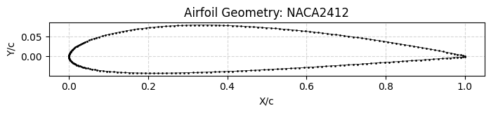
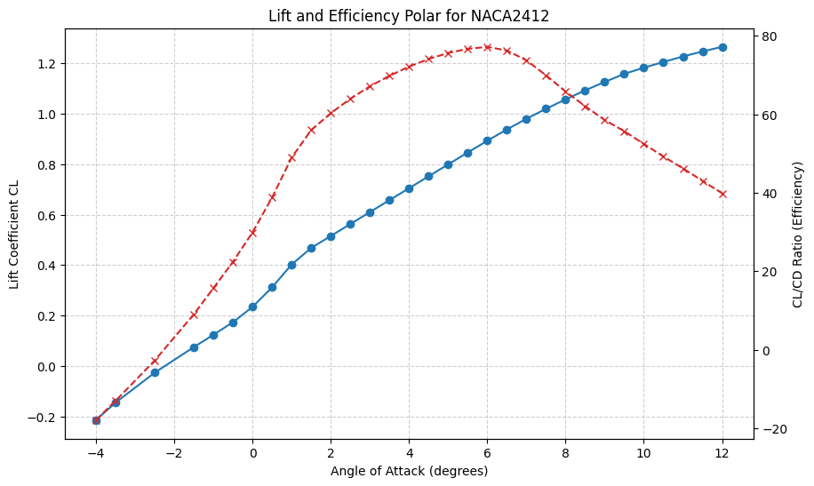
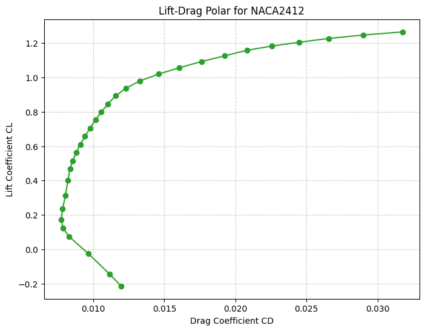
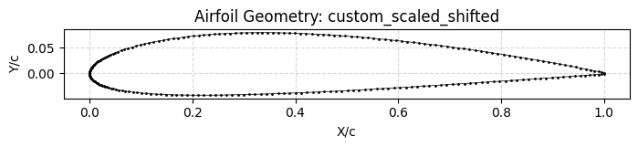
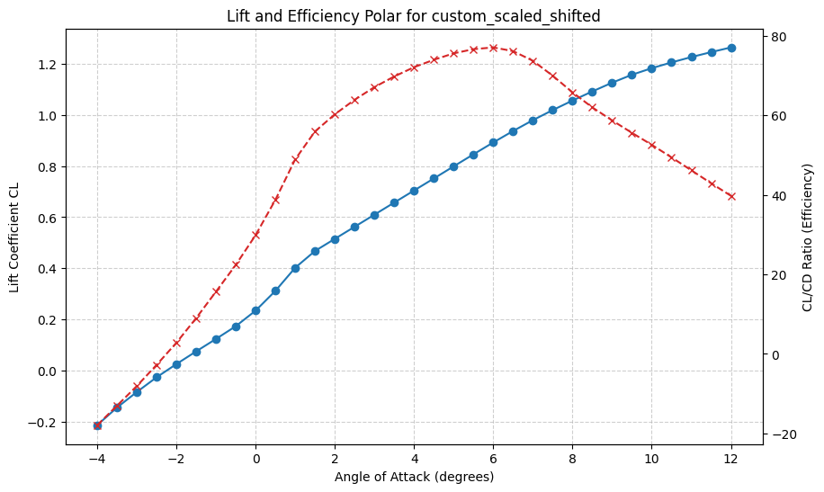
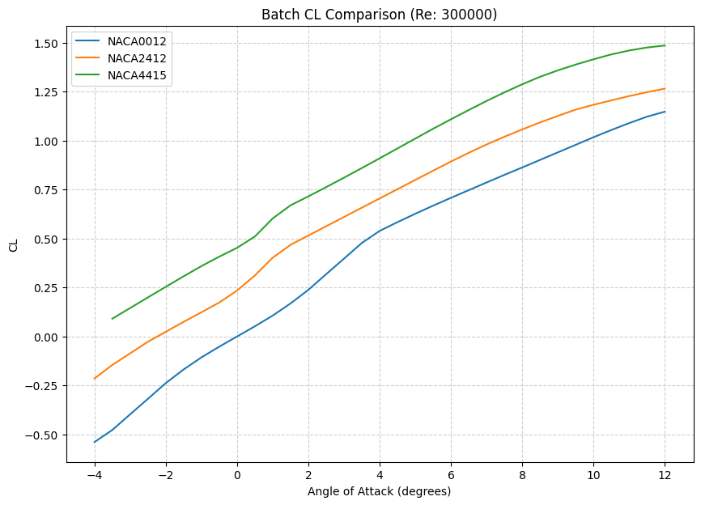
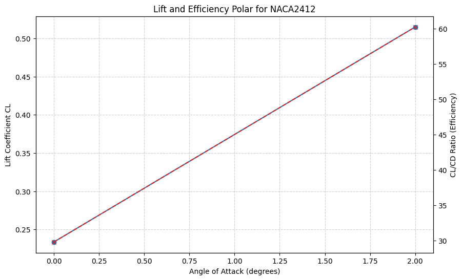

# Example outputs

These outputs were generated with the program and a locally installed Windows XFOIL 6.99 on 2026-09-10. Numerical values and convergence outcomes are unedited. The batch report's machine-specific diagnostic paths were replaced with relative paths. Successful runs' verbose solver logs are omitted; command scripts, raw polars, and coordinates are included. The intentionally failed case includes its diagnostic log.

## 1. NACA 2412 analysis

Reynolds number **300,000**, alpha **-4 to 12 degrees** in **0.5-degree steps**, **240 panels**, **300 iterations**, **30-second timeout**. This run converged at **31 of 33** requested angles; -3 and -2 degrees are missing. Artifact delivery completed.

Maximum observed CL is **1.2650**, maximum CL/CD is **77.156**, and minimum CD is **0.00774**. These are sampled extrema, not proof of stall or an optimum outside this sweep.





[Analysis report](naca2412/Analysis_Report.txt) · [Raw polar](naca2412/polar.txt) · [Coordinates](naca2412/coordinates.dat) · [Commands](naca2412/commands.txt)

## 2. Custom coordinate normalization

The custom input was generated locally from the first example's saved coordinates by multiplying both coordinates by 2 and translating by `(2, 0.5)`. XFOIL normalizes this input to unit chord with the leading edge at the origin. Orientation is preserved. Compare the [input](custom_normalization/input.dat) with the [saved analyzed coordinates](custom_normalization/coordinates.dat).

With the same conditions and settings as example 1, this run converged at **33 of 33** angles. Maximum observed CL is **1.2646**, maximum CL/CD is **77.081**, and minimum CD is **0.00774**. Reloading saved coordinates and repaneling can produce small differences and different convergence outcomes; the examples are not numerically identical.




[Analysis report](custom_normalization/Analysis_Report.txt) · [Raw polar](custom_normalization/polar.txt) · [Drag polar plot](custom_normalization/CL_vs_CD_Polar.png) · [Commands](custom_normalization/commands.txt)

## 3. Parallel batch comparison

Three supplied candidates share the settings and sweep from example 1:

| Airfoil | Status | Converged points | Maximum CL | Maximum CL/CD | Minimum CD |
| --- | --- | --- | --- | --- | --- |
| NACA 0012 | Complete | 33/33 | 1.1473 | 53.484 | 0.00768 |
| NACA 2412 | Partial | 31/33 | 1.2650 | 77.156 | 0.00774 |
| NACA 4415 | Partial | 32/33 | 1.4850 | 85.549 | 0.00941 |

NACA 4415 has the highest observed lift and efficiency in this comparison; NACA 0012 has the lowest observed drag. Rankings include partial sweeps, so inspect coverage before interpreting the winners.




[Batch report](batch_comparison/Batch_Optimization_Report.txt) · Raw job data: [0012](batch_comparison/jobs/001_NACA0012/polar.txt), [2412](batch_comparison/jobs/002_NACA2412/polar.txt), [4415](batch_comparison/jobs/003_NACA4415/polar.txt). Each job directory also includes coordinates and commands.

## 4. Partial convergence

This short NACA 2412 sweep uses Reynolds number **300,000**, alpha **0 to 2 degrees** in **1-degree steps**, **160 panels**, **100 iterations**, and a **30-second timeout**. Only **2 of 3** points converge; the report explicitly lists the missing 1-degree point. Valid samples and all single-run plots remain available.



Lines connect the available samples; the connecting segment does not supply a solved result at 1 degree.

[Analysis report](partial_convergence/Analysis_Report.txt) · [Raw polar](partial_convergence/polar.txt) · [Geometry](partial_convergence/Airfoil_Shape.png) · [Drag polar](partial_convergence/CL_vs_CD_Polar.png) · [Commands](partial_convergence/commands.txt)

## 5. Invalid geometry failure

The [deliberately invalid input](failed_input/input.dat) contains three identical points. Coordinate validation rejects it before launching XFOIL because it has zero chord and fewer than three distinct points. The program still writes a [failure report](failed_input/Analysis_Report.txt) and [diagnostic log](failed_input/xfoil.log). No aerodynamic results or plots are invented for this case.

## Regenerate the examples

After installing dependencies and XFOIL as described in the [main README](../README.md), run from the project directory:

```powershell
.\.venv\Scripts\python.exe tools/generate_examples.py
```

This overwrites the curated example files. The generator sets its own solver settings for the examples and restores the in-memory settings afterward; it does not write your personal configuration. Temporary run output is cleaned up. The [machine-readable index](index.json) records conditions, settings, coverage, metrics, and the solver executable's SHA-256 fingerprint.

The generator expects the short sweep to demonstrate partial convergence and stops for inspection if that behavior changes. Convergence can vary with the solver build and platform; review the index and update this narrative when regenerating with a different environment. PNGs are the program's own plots, with no visual retouching.
